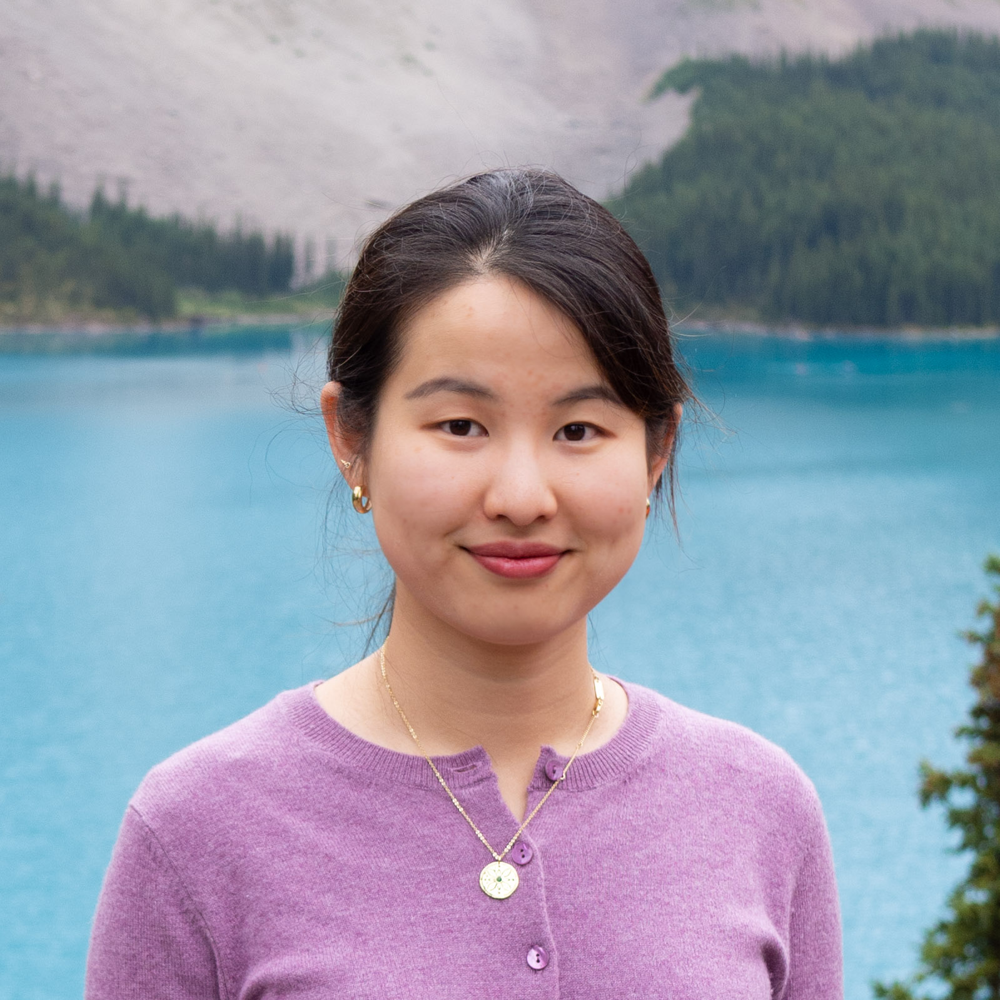

	
	
# Lydia T. Liu #

I am a third-year PhD student in [Computer Science](https://eecs.berkeley.edu/) at University of California, Berkeley, advised by [Moritz Hardt](http://www.moritzhardt.com/) and [Michael I. Jordan](https://people.eecs.berkeley.edu/~jordan/). I am affiliated with [RISELab](http://rise.cs.berkeley.edu/) and [BAIR](http://bair.berkeley.edu/).
Previously, I obtained my BSE in [Operations Research and Financial Engineering](https://orfe.princeton.edu/) from Princeton University, where I was fortunate to work with [Amit Singer](https://web.math.princeton.edu/~amits/), [Han Liu](https://www.princeton.edu/~hanliu/), and [Barbara Engelhardt](https://www.cs.princeton.edu/~bee/). I have also spent two wonderful summers interning at Microsoft Research: hosted by Urun Dogan and [Katja Hofmann](https://www.microsoft.com/en-us/research/people/kahofman/) in the [Reinforcement Learning Group](https://www.microsoft.com/en-us/research/group/reinforcement-learning-group/) at [MSR Cambridge](https://www.microsoft.com/en-us/research/lab/microsoft-research-cambridge/) in 2016, and hosted by [Jennifer Chayes](https://www.microsoft.com/en-us/research/people/jchayes/), [Christian Borgs](https://www.microsoft.com/en-us/research/people/borgs/), and [Adam Tauman Kalai](https://www.microsoft.com/en-us/research/people/adum/) at [MSR-NE](https://www.microsoft.com/en-us/research/lab/microsoft-research-new-england/) in 2019.

In 2019-20, I am supported by a [Microsoft Ada Lovelace Fellowship](https://www.microsoft.com/en-us/research/academic-program/ada-lovelace-fellowship/) and an [Open Philanthropy AI Fellowship](https://www.openphilanthropy.org/focus/global-catastrophic-risks/potential-risks-advanced-artificial-intelligence/open-phil-ai-fellowship-2019-class).

I am interested in developing **machine learning** algorithms that have **reliable performance guarantees**, and **positive long-term societal impact**. Read about my [research](/projects).

Outside of research, I enjoy photography, music, and <a href="/writing">poetry</a>.
			
Email: `lydiatliu_at_berkeley_dot_edu`

